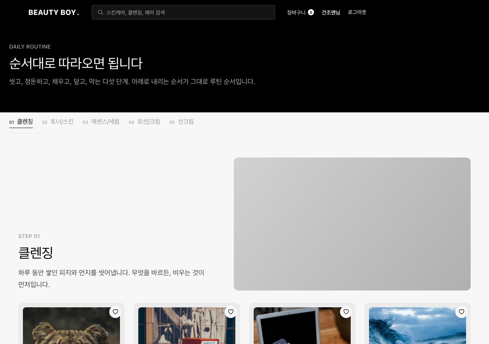
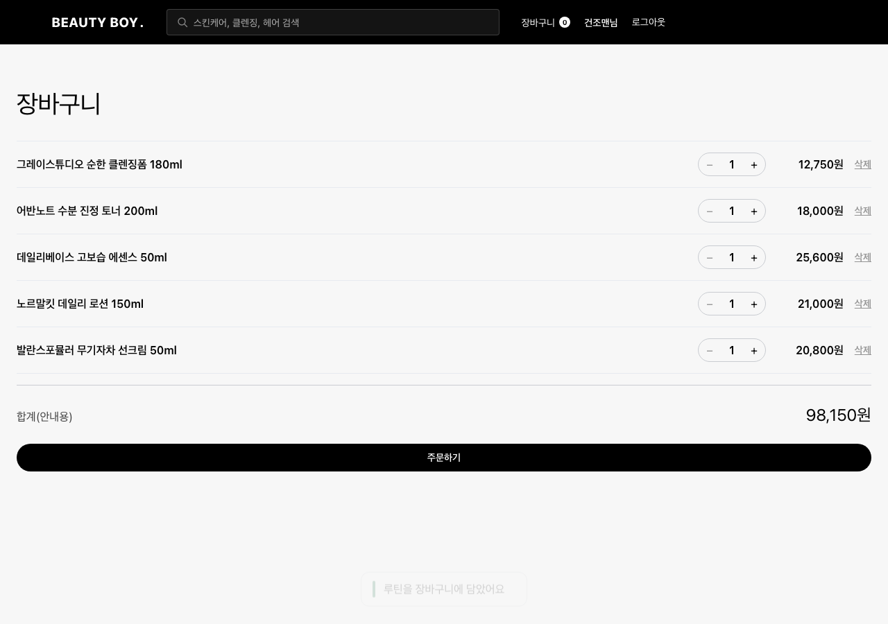
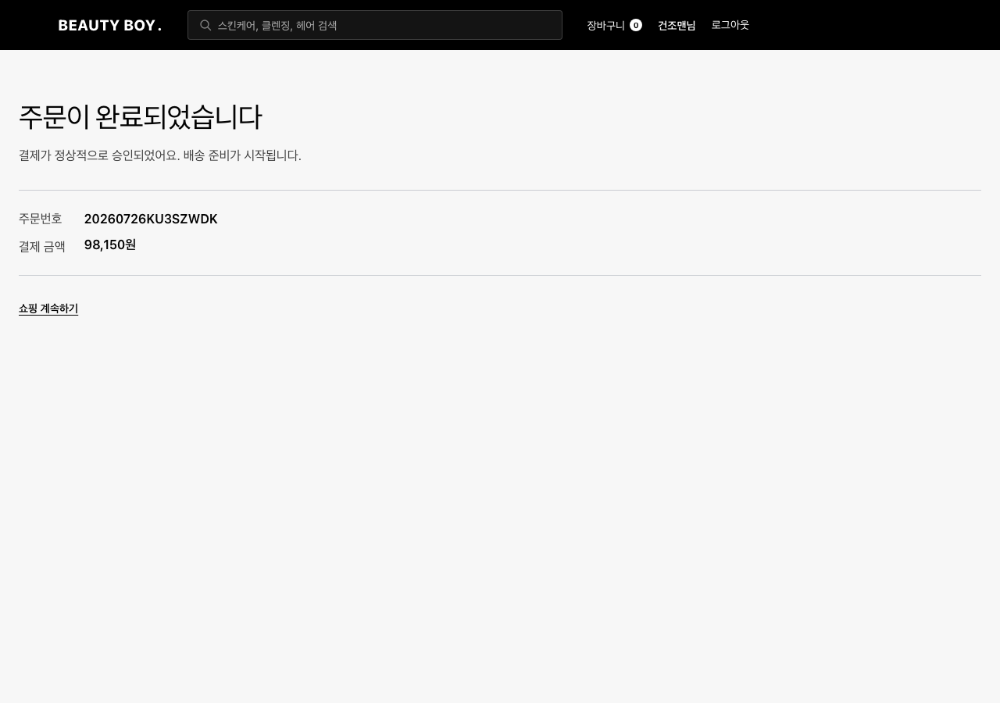

# 뷰티보이 (BeautyBoy)

올리브영을 벤치마크한 **남성 화장품 커머스 플랫폼**. 취업 포트폴리오 프로젝트로,
"완성도 있는 범위 + 설계 이유를 설명할 수 있는 것"을 최우선 가치로 둔다.

## 현재 상태

**1차 MVP 완성.** 회원가입/로그인부터 상품 탐색·검색·랭킹·성분 궁합, 루틴 가이드,
장바구니·주문·토스 결제(2단계 검증), 리뷰·문의, 마이페이지, admin 최소 CRUD까지
탐색→결제→마이페이지 전 구간이 실API로 동작한다. 전체 웨이브 구조는
[`docs/plans/2026-07-23-roadmap.md`](docs/plans/2026-07-23-roadmap.md) 참고.

## 기술 스택

| 영역 | 구성 |
|---|---|
| 백엔드 | Spring Boot 3.5.0, Java 21, Spring Security, Spring Data JPA, Flyway, JJWT 0.12.6, MySQL(운영) / H2(테스트) |
| 프론트엔드 | React 19, TypeScript, Vite 8, React Router 7, TanStack Query 5, Zustand 5, Axios, Vitest + Testing Library + MSW, Playwright |
| 인프라 | MySQL 8.4 (Docker Compose), Redis(선택 — 조회수 버퍼, 없으면 DB 폴백) |

## 실행 방법

### 1. MySQL 기동

```bash
docker compose up -d
```

> **알려진 함정**: 호스트에 이미 로컬 MySQL(예: `brew services`로 띄운 mysqld)이 3306 포트를
> 점유하고 있으면 `docker compose up -d`가 포트 바인딩 실패로 죽는다. 이 프로젝트 세팅 중 실제로
> 겪은 문제다. 해결책:
> - 기존 mysqld를 내린다 (`brew services stop mysql` 등), 또는
> - `docker-compose.yml`의 `ports`를 `"3307:3306"`처럼 바꾸고 `application-local.yml`의
>   `datasource.url` 포트도 함께 맞춘다.

### 2. Redis 기동 (선택)

조회수 집계는 Redis `INCR` 버퍼(1분 주기 DB 플러시)를 우선 사용하고, **Redis가 없거나 연결에
실패하면 조회수 증가가 DB 즉시 반영으로 폴백**한다 — 부가 기능(조회수 버퍼링) 하나가 죽는다고
본 기능(상세 페이지 조회)까지 죽으면 안 된다는 원칙이다. 로컬에서 Redis 없이 그냥 실행해도
동작에는 문제가 없다. 붙이고 싶으면:

```bash
docker run -d --name bb-redis -p 6379:6379 redis:7
```

> `docker-compose.yml`의 backend 서비스에는 아직 `REDIS_HOST`/`depends_on: redis`가 배선돼 있지
> 않다 — compose로 전체 스택을 띄우면 항상 DB 폴백 경로를 탄다("알려진 한계" 참고).

### 3. 백엔드 로컬 설정

```bash
cp backend/src/main/resources/application-local.yml.example backend/src/main/resources/application-local.yml
```

`application-local.yml`은 `.gitignore` 대상이라 커밋되지 않는다. 안의 DB 비밀번호(`local1234`)는
`docker-compose.yml`의 로컬 전용 MySQL 컨테이너 값과 짝을 이루는 예시이므로 그대로 써도 된다.

시크릿(JWT 시크릿, 토스 시크릿 키, DB 비밀번호)은 코드·커밋에 절대 넣지 않는다 — 환경변수 또는
`.env.local`/`application-local.yml`(둘 다 gitignore 대상)로만 주입한다.

**JWT 시크릿**은 코드/설정 파일에 넣지 않고 환경변수로 주입한다. `TokenProvider`가 HMAC 키를
`Base64.decode(secret)`로 만들기 때문에 **반드시 Base64로 인코딩된 값**이어야 한다 — 임의의
평문 문자열을 넣으면 컨텍스트 로딩 단계에서 기동이 실패한다:

```bash
export JWT_SECRET="$(openssl rand -base64 48)"
```

**토스페이먼츠 키**는 백엔드 `TOSS_SECRET_KEY`(테스트 시크릿 키), 프론트 `.env`의
`VITE_TOSS_CLIENT_KEY`(테스트 클라이언트 키)로 각각 주입한다. 둘 다 [토스페이먼츠 개발자센터](https://developers.tosspayments.com/)에서
무료로 발급받는 **테스트 키**이며, 실제 값은 이 문서에 적지 않는다.

### 4. 백엔드 실행

```bash
cd backend
./gradlew bootRun --args='--spring.profiles.active=local'
```

기동 시 Flyway가 마이그레이션(`db/migration/V1__member.sql` ~ `V66__seed_review.sql`)을 적용한다.
헬스체크: `curl http://localhost:8080/api/v1/health`

### 5. 프론트엔드 실행

```bash
cd frontend
npm install
npm run dev
```

Vite 개발 서버가 `/api` 요청을 `http://localhost:8080`으로 프록시한다(`vite.config.ts`).
기본 주소: `http://localhost:5173`

### 6. 시드 계정

`V64__seed_member.sql`(Task 4-15)이 데모용 계정을 심어둔다. **비밀번호는 전부 `seed1234!`
— 운영 비밀번호가 아니라 로컬 시드 전용 값이라 그대로 공개해도 무방하다.**

| 계정 | 역할 |
|---|---|
| `admin@beautyboy.dev` | 관리자 (`/admin` 패널 접근) |
| `dry@beautyboy.dev` | 일반 회원 — 건성 피부 프로필 |
| `oily@beautyboy.dev` | 일반 회원 — 지성 피부 프로필 |

### 7. 테스트

네 종류를 목적이 다르게 나눠 둔다.

```bash
# 백엔드 단위/슬라이스 — H2(MySQL 모드), 별도 DB 기동 불필요, 터미널 병렬 안전
cd backend && ./gradlew test

# 백엔드 통합 — 실 MySQL 8.4 Testcontainers, Docker 필요
cd backend && ./gradlew integrationTest
```

> **`./gradlew integrationTest`(Docker 필요)는 생략하면 안 되는 스위트다.** Flyway V1~V66
> 마이그레이션이 실제로 적용되고 `ddl-auto=validate`로 엔티티-스키마 정합을 검증하는 것 외에,
> **리프레시 토큰 동시성(Task 4-16a)의 유일한 회귀 방어**가 여기(`AuthRefreshConcurrencyMysqlIntegrationTest`)에
> 있다. 프론트가 부트스트랩 refresh를 in-flight 공유하도록 고쳐진 뒤로 Playwright E2E는 실제
> 동시 refresh 요청을 더 이상 만들지 않으므로, E2E 통과만으로는 이 동시성 버그가 되살아나도
> 잡히지 않는다. 그리고 H2는 InnoDB와 잠금 동작이 달라 이 클래스의 시나리오(동시 트랜잭션이
> 같은 리프레시 토큰 행을 다투는 것)를 재현하지 못한다 — 이 프로젝트는 실제로 H2가 실 MySQL
> 문제를 가린 이력이 있다. 이 스위트를 머지 게이트에서 빼면 Task 4-16a의 증거가 통째로 사라진다.

```bash
# 프론트 유닛 — Vitest
cd frontend && npm run test

# 프론트 E2E — Playwright. 백엔드를 e2e 프로필로 먼저 띄워야 한다 (아래 절 참고)
cd frontend && npm run test:e2e
```

### 8. E2E(Playwright) 실행법

Playwright의 `webServer` 설정은 **프론트(`npm run dev`)만** 자동으로 띄운다 — 백엔드·MySQL은
사람이 미리 띄워둬야 한다. 백엔드는 반드시 **`e2e` 프로필**로 띄운다: 이 프로필은 실제 토스
API를 호출하지 않는 `FakePaymentGateway`(`@Profile("e2e")`)를 활성화해, 결제 승인 로직(2단계
검증)은 그대로 태우면서 외부 결제사 네트워크 호출만 걷어낸다.

```bash
# 1) MySQL(임시 컨테이너, 13306 — 로컬 3306 점유 회피)
docker run -d --name bb-e2e-mysql \
  -e MYSQL_DATABASE=beautyboy -e MYSQL_ROOT_PASSWORD=local1234 \
  -p 13306:3306 mysql:8.4
until docker exec bb-e2e-mysql mysqladmin ping -uroot -plocal1234 2>/dev/null; do sleep 1; done

# 2) 백엔드 — e2e 프로필(FakePaymentGateway 활성화). JWT_SECRET은 반드시 Base64.
cd backend
DB_URL="jdbc:mysql://localhost:13306/beautyboy" \
DB_USERNAME=root DB_PASSWORD=local1234 \
JWT_SECRET="$(openssl rand -base64 48)" \
SPRING_PROFILES_ACTIVE=e2e \
./gradlew bootRun --args='--server.port=8080'
# 로그에서 `The following 1 profile is active: "e2e"` 확인

# 3) 프론트 — Playwright webServer가 자동으로 `npm run dev`를 띄운다(reuseExistingServer:true
#    이므로 이미 떠 있으면 재사용). 수동으로 먼저 띄워도 무방:
cd frontend
npm run dev   # http://localhost:5173, vite 프록시가 /api → localhost:8080

# 4) 테스트 실행
cd frontend
npm run test:e2e
```

정리:
```bash
pkill -f bootRun; lsof -ti:8080 | xargs kill -9 2>/dev/null
docker rm -f bb-e2e-mysql
```

## 주요 화면

데스크톱(1280px) 기준, 시드 계정(`dry@beautyboy.dev`)으로 탐색→루틴 담기→주문 완료까지의
실제 렌더 결과다.

| 메인 | 루틴 가이드 |
|---|---|
|  |  |

| 상품 상세 | 장바구니 |
|---|---|
|  |  |

| 주문 완료 |
|---|
|  |

## 설계 하이라이트

- **결제 2단계 검증**: 클라이언트가 보낸 결제 금액을 그대로 믿지 않는다. 서버가 주문 생성
  시점의 스냅샷(가격·수량·옵션 추가금)으로 금액을 다시 계산해, 토스 승인 응답 금액과 대조한
  뒤에만 결제를 확정한다. 금액을 위조한 승인 요청은 여기서 거부되고 주문이 완료 처리되지
  않는다(E2E `checkout.spec.ts`의 "금액을 위조한 승인 요청은 거부되고 완료로 표시되지 않는다"가
  이 경로를 그대로 검증한다). 결제는 "클라이언트를 믿을 수 없는" 유일한 화폐 경계이므로, 프론트
  계산은 안내용이고 최종 판단은 항상 서버 몫이다.
- **패키지 = 서비스 경계 + 의존성 역전**: 도메인 패키지(`member` `catalog` `ingredient` `search`
  `cart` `order` `payment` `review` `ranking` `delivery` `routine`)는 자기 테이블만 접근하고,
  타 도메인 데이터가 필요하면 자신이 정의한 인터페이스(예: `ranking.SalesStatProvider`,
  `ranking.WishStatProvider`)를 상대가 구현하게 한다. 랭킹 점수(판매×3 + 찜×2 + 조회×1)가 order·
  wishlist 테이블을 직접 읽으면 도메인 경계가 무너지므로, "필요한 쪽이 인터페이스를 정의하고
  가진 쪽이 구현한다"는 방향으로 뒤집었다. 병렬 터미널이 서로의 엔티티를 모르는 채로 개발할 수
  있었던 것도 이 경계 덕분이다.
- **성분 궁합 분류쌍은 주문을 막지 않는다**: `POST /compat/check`는 CONFLICT(성분 충돌)를
  진단해도 장바구니 담기·주문을 차단하지 않는다. 성분 궁합은 "이 조합은 자극이 겹칠 수 있다"는
  **정보 제공**이지, 의학적 금지가 아니다. 실제 피부 반응은 사람마다 다르고, 화장품 성분 상호작용에
  절대적 안전 게이트를 걸 근거가 없다 — 사용자의 최종 선택권을 존중하면서 판단 재료만 준다.
- **조회수 Redis 버퍼, 없으면 DB 폴백**: 상세 조회수는 Redis `INCR`로 버퍼링했다가 1분 주기로
  DB에 플러시한다(쓰기 폭주 완화). 하지만 Redis 연결이 실패하면 즉시 DB 카운터 증가로 폴백한다 —
  조회수 집계라는 **부가 기능**이 죽었다고 상세 페이지 조회라는 **본 기능**까지 죽여선 안 된다는
  원칙을 그대로 코드에 반영했다.
- **Flyway 버전 대역 사전 분할**: 웨이브·터미널마다 쓸 수 있는 Flyway 번호 대역을 병렬 착수
  *전에* 미리 나눠뒀다(`docs/plans/2026-07-23-roadmap.md`의 "병렬 안전을 위한 공유 계약" 참고,
  예: Wave 2 T2는 V30~V39). 여러 터미널이 동시에 마이그레이션을 추가해도 번호가 절대 부딪히지
  않아, 머지 시점에 번호를 다시 매기는 리베이스 지옥을 피했다.

## 프로젝트 구조

```
backend/
  src/main/java/com/beautyboy/
    common/        # ApiResponse, ErrorCode, BusinessException, GlobalExceptionHandler
    config/        # SecurityConfig, JwtProperties
    auth/          # 로그인/리프레시/로그아웃, JWT 발급·검증
    member/        # 회원가입, 내 정보, 피부 프로필, 배송지
    catalog/       # 카테고리·브랜드·상품·옵션
    ingredient/    # 성분·규제 플래그·궁합 규칙·종합판정
    search/        # 검색(FULLTEXT)
    ranking/       # 랭킹(판매·찜·조회 가중합)
    cart/          # 장바구니
    order/         # 주문
    payment/       # 토스 결제(2단계 검증), FakePaymentGateway(e2e)
    review/        # 리뷰
    qna/           # 문의
    wishlist/      # 찜
    routine/       # 루틴 템플릿·단계, 궁합 진단
    admin/         # 관리자 CRUD(상품·루틴·문의)
  src/main/resources/
    application.yml, application-local.yml.example
    db/migration/  # Flyway (V1~V66)
frontend/
  src/
    api/           # axios 클라이언트, 도메인별 API 모듈
    stores/        # authStore (Zustand)
    components/    # layout, cart, goods, routine, admin 등
    pages/         # Home, Login, Signup, Routine, Cart, Order, MyPage, Admin ...
    mocks/         # MSW 핸들러
  e2e/             # Playwright 스펙(checkout.spec.ts) + 로그인 픽스처
docs/
  superpowers/specs/2026-07-23-beautyboy-design.md  # 설계 문서(도메인·API·범위)
  plans/2026-07-23-roadmap.md                       # 구현 로드맵(웨이브 구조)
  screenshots/                                       # 주요 화면 스크린샷
```

## 문서

- 설계 문서: [`docs/superpowers/specs/2026-07-23-beautyboy-design.md`](docs/superpowers/specs/2026-07-23-beautyboy-design.md)
- 구현 로드맵: [`docs/plans/2026-07-23-roadmap.md`](docs/plans/2026-07-23-roadmap.md)
- 실행 모델·모델 배분·공통 규칙: [`CLAUDE.md`](CLAUDE.md)
