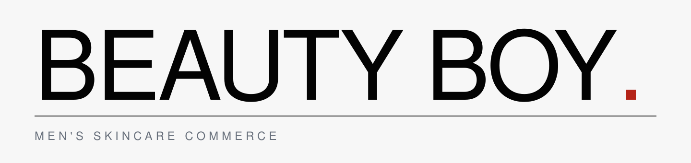
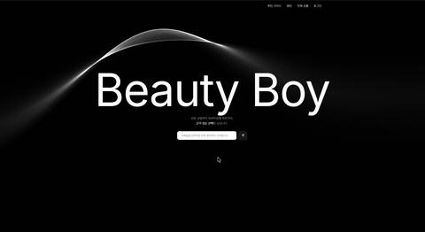
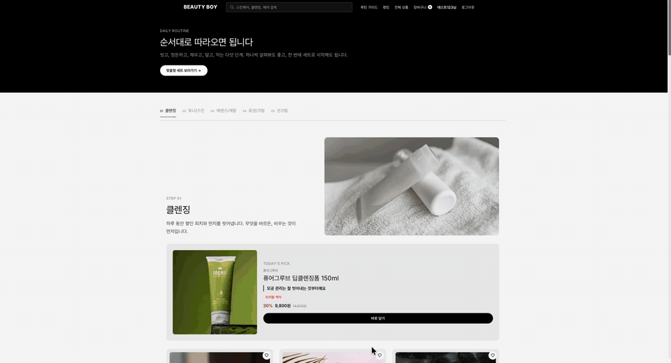
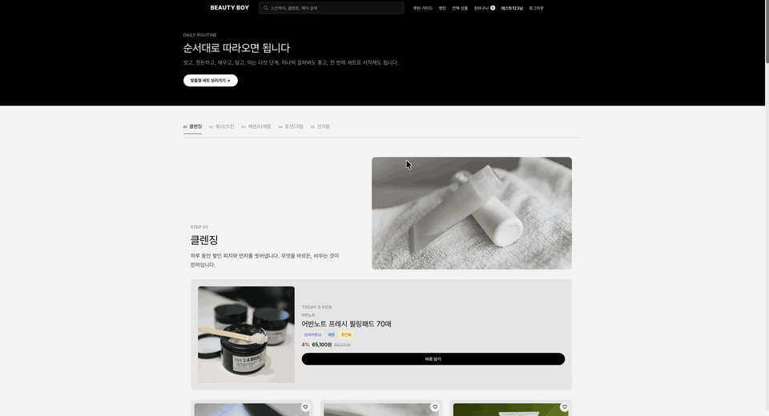
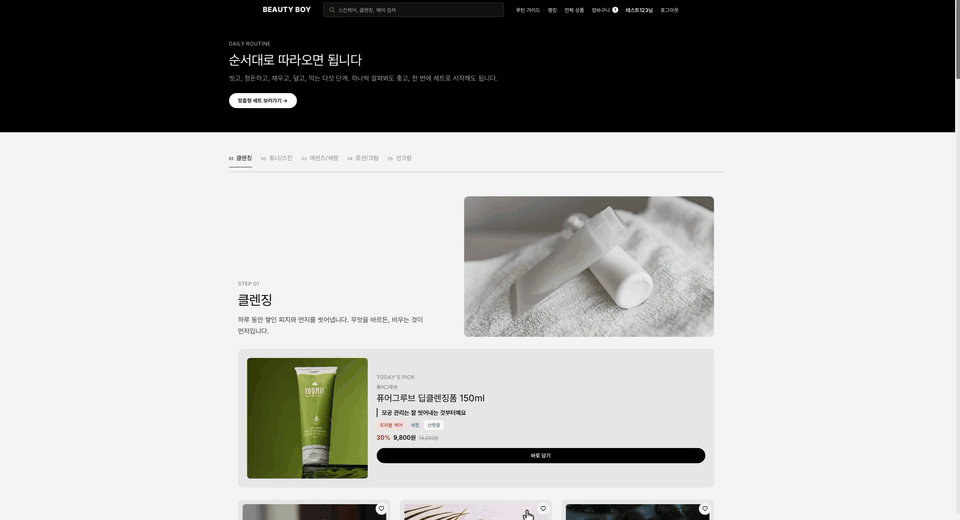
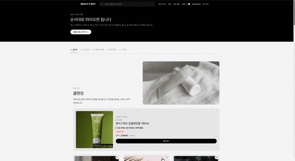
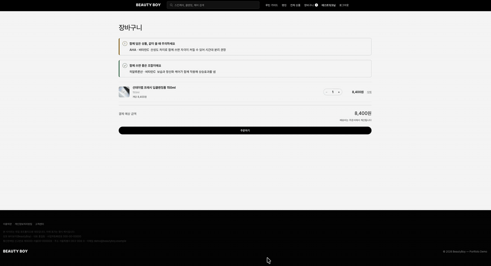
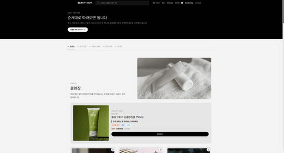
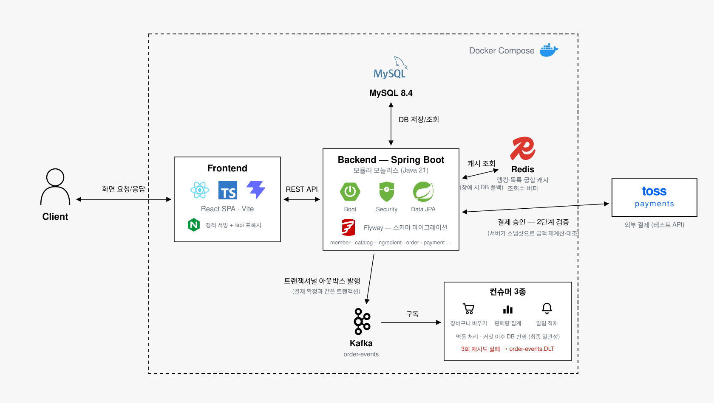

<p align="center">
  
</p>

<p align="center">
  <strong>스킨케어 순서를 모르는 남성을 위한 커머스</strong><br/>
  상품이 아니라 <strong>루틴(순서)</strong>을 판다.<br/>
  피부 프로필 기반 개인화, 성분 궁합 진단, 토스 결제까지 전 구간이 실API로 동작하는
  남성 화장품 커머스 플랫폼
</p>

# Table of Contents

- [서비스 소개](#service-intro)
- [데모 예시](#demo-examples)
- [차별화 포인트](#differentiation)
- [시스템 아키텍처](#system-architecture)
- [기술 스택](#tech-stack)
- [실행 방법](#how-to-start)
- [만든 사람](#members)

<a id="service-intro"></a>

# 🧴 서비스 소개

<h3>
화장품 커머스는 많지만, 대부분은 "이미 뭘 살지 아는 사람"을 위한 곳입니다.
</h3>

<h3>
BeautyBoy는 질문을 바꿨습니다 — "무엇을 살까"가 아니라 <strong>"어떤 순서로 뭘 쓰면 되는데, 그걸 지금 여기서 살 수 있나"</strong>.
</h3>

<table>
  <tr>
    <th width="28%">주요 기능</th>
    <th width="72%">설명</th>
  </tr>
  <tr>
    <td><h3>피부 프로필 개인화</h3></td>
    <td><h3>가입 시 피부타입·고민(모공, 트러블, 보습 등 9종)·선호 사용감을 받아 메인·루틴·추천 전 화면의 개인화 재료로 사용</h3></td>
  </tr>
  <tr>
    <td><h3>루틴 가이드</h3></td>
    <td><h3>클렌징 → 토너 → 세럼 → 로션 → 선케어 5단계를 목차처럼 읽고 단계별 추천 상품을 그대로 담을 수 있는 페이지</h3></td>
  </tr>
  <tr>
    <td><h3>성분 궁합 진단</h3></td>
    <td><h3>식약처 공공데이터 기반 규칙 엔진으로 단일 상품의 성분 주의도와, 장바구니 상품과의 충돌 조합(레티놀 × AHA 등)을 진단</h3></td>
  </tr>
  <tr>
    <td><h3>탐색·검색·랭킹</h3></td>
    <td><h3>카테고리·브랜드 탐색, FULLTEXT 검색, 판매×3 + 찜×2 + 조회×1 가중합 랭킹</h3></td>
  </tr>
  <tr>
    <td><h3>장바구니 · 토스 결제</h3></td>
    <td><h3>토스페이먼츠 2단계 검증 — 서버가 주문 스냅샷으로 금액을 재계산해 승인 응답과 대조한 뒤에만 결제 확정</h3></td>
  </tr>
  <tr>
    <td><h3>리뷰 · 문의 · 마이페이지 · Admin</h3></td>
    <td><h3>리뷰(피부타입 스냅샷 저장), 상품 문의, 프로필·배송지 관리, 관리자 CRUD까지 전 구간 실API 동작</h3></td>
  </tr>
</table>

<a id="demo-examples"></a>

# 🎬 데모 예시

<h2>📝 01. 회원가입 — 피부 프로필 입력</h2>

<h3>피부타입·고민·선호 사용감을 고르면 이후 모든 화면의 개인화 재료가 됩니다.</h3>



<h2>🧭 02. 메인 — 개인화된 루틴 흐름</h2>

<h3>내 고민(모공 등)이 반영된 루틴 5단계 섹션이 이유와 함께 재구성됩니다.</h3>



<h2>📖 03. 루틴 가이드 · 랭킹 · 전체 상품</h2>

<h3>순서를 가르쳐주는 루틴 가이드에서 랭킹·전체 상품 탐색으로 이어집니다.</h3>



<h2>🔬 04. 상품 상세 — 성분 궁합 진단</h2>

<h3>성분 구성을 안전/주의 신호로 보여주고, 장바구니 상품과의 성분 충돌을 진단합니다.</h3>



<h2>🧺 05. 루틴 세트 담기</h2>

<h3>루틴 단계별 추천 상품을 세트로 한 번에 장바구니에 담습니다.</h3>



<h2>💳 06. 주문 · 토스 결제</h2>

<h3>서버가 금액을 재검증하는 2단계 검증으로 결제를 확정합니다.</h3>



<h2>👤 07. 마이페이지 — 프로필 변경</h2>

<h3>피부 프로필을 바꾸면 메인·루틴 추천이 즉시 따라옵니다.</h3>



<a id="differentiation"></a>

# ✨ 차별화 포인트

<table>
  <tr>
    <th width="22%">차별화 요소</th>
    <th width="34%">일반 화장품 커머스</th>
    <th width="44%">BeautyBoy</th>
  </tr>
  <tr>
    <td><h3>탐색 기준</h3></td>
    <td>카테고리 트리, 검색, 인기 상품 중심</td>
    <td><h3>루틴 단계가 곧 내비게이션 — "세럼이 뭔지" 몰라도 3단계에 도착하면 지금 사야 할 것이 나온다</h3></td>
  </tr>
  <tr>
    <td><h3>개인화 방식</h3></td>
    <td>서버가 행동 로그를 수집해 추천 배치를 돌림</td>
    <td><h3>"돈과 재고는 서버, 취향은 클라이언트" — 행동 점수는 기기(localStorage)에서 계산, 규칙의 진실만 서버가 배포. 서버 비용 0 · 즉시 반영 · 프라이버시</h3></td>
  </tr>
  <tr>
    <td><h3>성분 정보</h3></td>
    <td>전성분 텍스트 나열</td>
    <td><h3>식약처 공공데이터 + 카탈로그 1,472개 성분 실측 분포로 주의도를 판정하고, 함께 쓰면 충돌하는 조합을 자동 진단</h3></td>
  </tr>
  <tr>
    <td><h3>결제 신뢰 경계</h3></td>
    <td>클라이언트가 보낸 금액 기반 승인</td>
    <td><h3>주문 스냅샷으로 서버가 금액을 재계산해 대조하는 2단계 검증 — 금액 위조 승인 요청은 거부(E2E로 검증)</h3></td>
  </tr>
</table>

<a id="system-architecture"></a>

# 🏗️ 시스템 아키텍처



<a id="tech-stack"></a>

## 🛠️ 기술 스택

| Category | Technology |
| :--- | :--- |
| **Backend** |      |
| **Frontend** |       |
| **Database & Messaging** |    |
| **Payment** |  |
| **Testing** |      |
| **Infrastructure** |   |

<a id="how-to-start"></a>

## 🚀 실행 방법

```bash
cp .env.example .env
# .env의 JWT_SECRET을 채운다 — 반드시 Base64 값이어야 한다
openssl rand -base64 48   # 출력값을 .env의 JWT_SECRET= 뒤에 붙여넣는다

docker compose up -d --build
```

| 서비스 | 주소 |
|---|---|
| 프론트엔드 | http://localhost:3000 |
| 백엔드 | http://localhost:8080 |
| MySQL | localhost:13306 |

MySQL → 백엔드(Flyway 마이그레이션 자동 적용) → 프론트 순으로 헬스체크에 따라 기동된다.

<a id="members"></a>

## 🧑‍💻 만든 사람

| Name | 서두현 |
| :--: | :----: |
| Profile | <a href="https://github.com/SeoDoo"></a> |
| GitHub | [SeoDoo](https://github.com/SeoDoo) |
