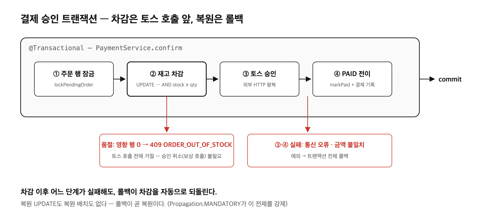
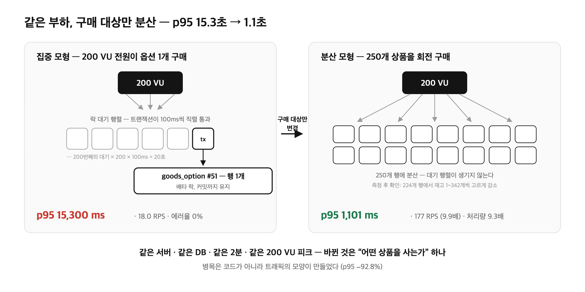
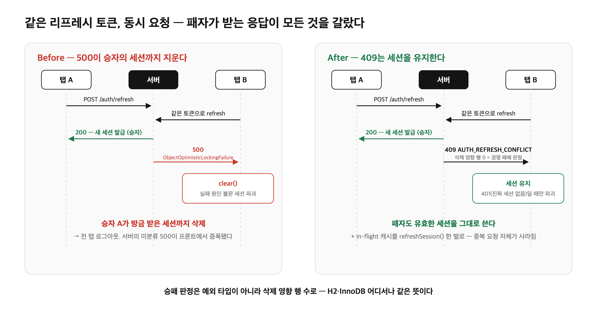

# BeautyBoy 트러블슈팅 — 재고, 락, 그리고 동시성

이 글은 BeautyBoy 프로젝트에서 겪은 세 가지 동시성 문제의 기록이다. 서비스가 무엇이고 어떤 설계 원칙 위에 서 있는지는 [소개 편]에 있다 — 이 편은 그 위에서 실제로 터진 문제와 해결만 다룬다.

## 문제점

BeautyBoy 프로젝트에는 서로 성격이 다른 세 가지 문제가 있었다.

**1. 재고 100개짜리 상품에 101번째 결제가 성공할 수 있었다.**
주문 생성 시점에 재고를 *검증*하는 코드는 있었지만, 결제가 승인돼도 재고를 *차감*하는 코드가 없었다. 검증과 결제 사이에 다른 주문이 끼어들면 초과 판매가 가능한 구조였다.

**2. 부하를 걸자 주문 확정 p95가 15.3초까지 치솟았다.**
타임세일 폭주를 가정한 k6 부하테스트(피크 200 VU)에서 에러율은 0%인데 p95 15.3초, p99 17.5초가 나왔다. 서버는 죽지 않았다. 다만 모두가 줄을 서고 있었다.

**3. 탭을 두 개 열어두면 멀쩡히 로그인돼 있던 계정이 풀렸다.**
여러 탭에서 동시에 하드 네비게이션하면 늦은 탭이 로그인 화면으로 튕겼다. 새로고침하면 복구됐다. "가끔, 재현이 안 되는" 종류의 버그였다.

세 문제는 겉모습이 다르지만 뿌리는 하나다 — **같은 데이터 행을 두 요청이 동시에 만질 때 무슨 일이 일어나는가**를 처음에 설계하지 않았다는 것.

---

# 첫 번째 문제 — 재고 차감: 복원 코드를 만들지 않는 설계

## 문제

기존 주문 흐름의 재고 관련 코드는 주문 생성 시점의 검증뿐이었다.

```java
// Before — 주문 생성 시 재고를 "읽고 비교"만 한다
if (option.getStock() < item.quantity()) {
    throw new BusinessException(ErrorCode.ORDER_OUT_OF_STOCK);
}
// ...주문 생성. 재고는 그대로다.
```

결제가 승인돼도 재고는 줄지 않는다. 문제는 차감 코드가 없다는 사실 자체보다, **차감을 어느 시점에 넣을 것인가**에 있었다. 커머스에서 재고 차감 시점은 보통 두 가지다.

- **주문 생성 시 차감** — 결제를 안 한 PENDING 주문이 재고를 잠근다. 그러면 일정 시간 후 재고를 되살리는 TTL 복원 배치, 만료 상태, 만료된 주문의 처리 정책이 줄줄이 따라온다.
- **결제 승인 시 차감** — 미결제 주문은 재고를 전혀 잠그지 않는다. 대신 승인 순간의 동시성을 정확히 다뤄야 한다.

전자는 "복원 인프라"라는 부수 시스템을 만들어야 하고, 후자는 트랜잭션 설계를 정확히 해야 한다. 후자를 골랐다. 그리고 목표를 하나 세웠다 — **복원 코드가 존재하지 않게 만든다.**

## 해결

### 1. 차감을 결제 승인 트랜잭션 안, 토스 호출 *직전*에 놓는다

결제 승인(`PaymentService.confirm`)은 하나의 `@Transactional` 안에서 순서대로 진행된다.

```java
@Transactional
public PaymentConfirmResponse confirm(Long memberId, PaymentConfirmRequest request) {
    // (a) 주문 행 잠금 + 검증
    ConfirmTarget target = orderConfirmPort.lockPendingOrder(request.orderNo(), memberId);
    // (b) 재고 차감 — 토스 호출 "전"
    stockCommandService.deductAll(...);
    // (c) 토스 결제 승인 (외부 HTTP)
    paymentGateway.confirm(request.paymentKey(), request.orderNo(), request.amount());
    // (d) PAID 전이 + 결제 기록
    orderConfirmPort.markPaid(target.orderId(), confirmedAt);
}
```

차감이 토스 호출보다 **앞**에 있는 것이 핵심이다.

- **품절이면 돈이 움직이기 전에 거절된다.** (b)에서 실패하면 (c)는 실행되지 않으므로, 승인된 결제를 취소하는 보상 호출이 필요 없다.
- **차감 이후 어떤 단계가 실패해도 — 토스 통신 오류, 금액 불일치 — 트랜잭션 롤백이 차감을 자동으로 되돌린다.** 복원 UPDATE도, 복원 배치도 없다. **롤백이 곧 복원이다.**

### 2. "트랜잭션 안에서만 불린다"는 전제를 코드로 강제한다

이 설계의 모든 보장은 "차감이 반드시 트랜잭션 안에서 호출된다"에 의존한다. 누군가 트랜잭션 없이 호출하면 차감이 그 자리에서 커밋되어 계약이 *조용히* 깨진다. 주석으로 부탁하는 대신 예외로 만들었다.

```java
@Override
@Transactional(propagation = Propagation.MANDATORY) // 트랜잭션 없는 호출 = 즉시 예외
public void deductAll(List<DeductionLine> lines) {
    Map<Long, Integer> merged = new TreeMap<>();
    for (DeductionLine line : lines) {
        merged.merge(line.optionId(), line.quantity(), Integer::sum);
    }
    for (Map.Entry<Long, Integer> entry : merged.entrySet()) {
        if (goodsOptionRepository.deduct(entry.getKey(), entry.getValue()) == 0) {
            throw new BusinessException(ErrorCode.ORDER_OUT_OF_STOCK);
        }
    }
}
```

짧은 코드지만 세 가지 판단이 들어 있다.

- **`TreeMap` 합산** — 같은 옵션이 주문에 여러 줄로 들어오면 합산 후 1회만 깎는다. 줄 단위로 깎으면 "합계는 부족한데 각 줄은 통과"하는 구멍이 생긴다.
- **`optionId` 오름차순** — 두 주문이 같은 옵션 집합을 서로 다른 순서로 깎으면 InnoDB 데드락이 난다. `TreeMap`의 정렬이 락 획득 순서를 전역으로 통일해 교차 데드락을 구조적으로 없앤다.
- **all-or-nothing** — 하나라도 영향 행이 0이면 예외 → 전체 롤백. "일부만 깎인 주문"은 존재할 수 없다.

### 3. 락은 조건부 UPDATE의 영향 행 수로 건다

```sql
UPDATE goods_option SET stock = stock - :qty
WHERE id = :optionId AND stock >= :qty
```

영향 행 수가 1이면 차감 성공, 0이면 재고 부족이다. `@Version` 낙관적 락을 쓰지 않은 이유가 있다 — 낙관적 락 충돌 시 **어떤 예외가 오는지가 DB 엔진마다 다르다**(H2의 잠금 타임아웃 vs InnoDB의 행 잠금 대기). 테스트는 H2에서 녹색인데 실 MySQL에서 조용히 깨진 이력이 이 프로젝트에 이미 있었다. 영향 행 수는 어느 엔진에서도 같은 뜻이다.

## 정리



| | Before | After |
|---|---|---|
| 재고 차감 | 없음 (검증만) | 결제 승인 트랜잭션 안, 토스 호출 직전 |
| 초과 판매 | 가능 | 조건부 UPDATE가 DB 레벨에서 차단 |
| 실패 시 복원 | — | 트랜잭션 롤백 = 복원 (복원 코드 0줄) |
| 교차 주문 데드락 | — | optionId 오름차순으로 락 순서 통일 |

---

# 두 번째 문제 — 주문 확정 p95 15.3초의 범인은 따로 있었다

## 문제

첫 번째 문제의 설계가 들어간 상태에서, 트래픽 개선 작업(Kafka 후처리 비동기화 + Redis 캐싱)을 시작하며 before 기준선을 남기려고 k6 부하테스트를 돌렸다. 주문 생성→결제 확정을 반복하는 시나리오, 10→50→200 VU 램프업 2분.

| 지표 | 값 |
|---|---|
| p50 | 4,470 ms |
| p90 | 13,010 ms |
| **p95** | **15,300 ms** |
| p99 | 17,470 ms |
| 에러율 | 0.00% |

주문 확정에 15초. 처음 세운 가설은 계획 그대로였다 — "확정 트랜잭션에 얹힌 후처리(알림, 랭킹 집계)가 무거우니, Kafka로 빼면 빨라질 것이다."

그런데 코드를 다시 읽다가 이상한 점을 발견했다. 문제는 개별 요청의 처리 속도가 아니라 **부하 모형과 락의 상호작용**에 있었다.

1. 테스트 스크립트는 200 VU **전원이 단 하나의 옵션**(`OPTION_ID=51`)을 산다 — 타임세일 폭주를 흉내 낸 극단 모형이다.
2. 재고 차감 UPDATE는 그 행에 배타 락을 걸고, 락은 **트랜잭션이 커밋될 때까지** 유지된다.
3. 그 트랜잭션 안에는 토스 승인 호출(부하테스트 프로필에서는 100ms 고정 지연 스텁)이 들어 있다 — 첫 번째 문제에서 "품절 시 보상 호출을 없애려고" 차감을 토스 호출 *앞*에 둔 바로 그 설계다.
4. 즉 피크의 200개 동시 트랜잭션이 **같은 행 하나의 락을 놓고 각자 최소 100ms씩 붙잡으며 직렬로 줄을 선다.**

산술로 검증해 봤다. 200개가 하나의 락을 100ms씩 잡고 지나가면 마지막 요청의 대기는 약 200 × 100ms = **20초**. 관측된 max 18.6초, p99 17.5초와 자릿수·형태(선형으로 증가하는 대기 행렬)가 정확히 맞아떨어진다.

이 가설이 맞다면 곤란한 결론이 하나 따라온다 — **준비 중이던 Kafka 비동기화는 이 수치를 거의 개선하지 못한다.** Kafka로 옮기는 것은 커밋 *이후*의 부수 작업인데, 락 보유 구간은 커밋 *이전*에 있기 때문이다. 이 예측을 측정 문서에 미리 적어 두었다. after 결과가 나왔을 때 "그럴 줄 알았다"는 사후 합리화가 아니라, 사전에 적은 가설과 실측을 대조하기 위해서다.

## 해결

### 1. 변수 하나만 바꾼 대조 실험

가설이 "단일 행 락 직렬화"라면, 구매를 여러 행으로 분산했을 때 대기 행렬이 사라져야 한다. 부하 모형(VU 램프업, 시간, threshold)은 그대로 두고 **"어떤 상품을 사는가" 하나만** 바꿨다 — 옵션 1개 → 250개 상품 회전.

```javascript
// confirm.js — LOAD_MODEL=spread일 때 250개 goods/option 쌍을 회전 선택
const pair = pairs[(__VU + __ITER) % pairs.length];
```

### 2. 결과 — p95 −92.8%, 처리량 9.3배



| 지표 | 집중 (옵션 1개) | 분산 (250개) | 변화 |
|---|---|---|---|
| p50 | 4,470 ms | 522.6 ms | −88.3% |
| **p95** | **15,300 ms** | **1,101.2 ms** | **−92.8%** |
| p99 | 17,470 ms | 1,229.9 ms | −93.0% |
| 완료 iteration | 1,148 | 10,651 | 9.3배 |
| RPS | 17.99 | 177.28 | 9.9배 |

같은 서버, 같은 DB, 같은 2분, 같은 200 VU 피크. 바뀐 것은 구매 대상 분산 하나뿐인데 p95가 15.3초에서 1.1초가 됐다. 측정 후 DB를 확인하니 250개 옵션 중 224개 행에서 재고가 1~342개씩 고르게 줄어 있었다 — 락 경합이 실제로 분산됐다는 물증이다.

**"confirm 경로가 느리다"는 진단은 틀렸다.** 애플리케이션은 개별 요청을 느리게 처리한 적이 없다. 좁은 공유 자원(재고 행 하나)에 대한 락 대기 행렬이 쌓인 것이고, 그것은 코드가 아니라 **트래픽의 모양**이 만든 병목이었다.

### 3. 남은 것

- 일반적인 다품목 트래픽(분산 모형)에서 confirm은 이미 p95 1.1초 수준이다 — Kafka 비동기화가 여기서 얻을 것은 제한적이다.
- 단일 인기 상품 폭주(집중 모형)는 여전히 15초다. 이걸 실제로 개선하려면 후처리 비동기화가 아니라 **락 보유 시간 자체**를 다뤄야 한다 — 차감을 토스 호출 뒤로 미루거나(보상 호출이라는 비용을 다시 지불), 재고를 Redis 카운터로 옮기는 식의 별도 처방이다. "무엇이 효과가 없는지"를 도입 전에 아는 것도 측정의 성과다.

## 정리

| | 측정 전 | 측정 후 |
|---|---|---|
| 진단 | "동기 후처리가 무겁다" (추정) | 단일 행 InnoDB 락 직렬화 (검증됨) |
| 근거 | 없음 | 대조 실험 p95 −92.8% + 산술 검증 + 재고 분산 물증 |
| Kafka 비동기화의 기대 효과 | confirm 지연 해소 | 커밋 이후 부수 작업에 한정 — 락 병목과는 별개 |

---

# 세 번째 문제 — 탭 두 개가 서로의 세션을 지웠다

## 문제

E2E 테스트 중 발견했다. 액세스 토큰이 만료된 상태에서 여러 탭이 동시에 리프레시를 시도하면, 늦은 탭이 로그인 화면으로 튕겼다.

리프레시 토큰은 보안을 위해 **회전(rotation)** 한다 — 한 번 쓰면 지우고 새로 발급한다. 문제의 코드는 이랬다.

```java
// Before — 조회한 엔티티를 그대로 delete
RefreshToken saved = refreshTokenRepository.findByTokenHash(hash(rawRefreshToken))
        .orElseThrow(() -> new BusinessException(ErrorCode.UNAUTHORIZED));
refreshTokenRepository.delete(saved);   // 두 트랜잭션이 같은 행을 잡으면?
return issueTokens(...);
```

같은 토큰으로 두 요청이 동시에 들어오면 늦은 쪽이 `ObjectOptimisticLockingFailureException`으로 죽고, 전역 핸들러는 그것을 **500**으로 흘려보냈다. 그리고 진짜 문제는 그다음이다 — 프론트 인터셉터가 리프레시 실패의 원인을 가리지 않고 세션을 지웠다.

```typescript
// Before — 실패 원인이 무엇이든 무조건 세션 파괴
} catch (refreshError) {
  useAuthStore.getState().clear();
}
```

500은 "세션이 없다"와 "지금 확인을 못 했을 뿐"을 구분해 주지 않는다. 그래서 경쟁에서 진 탭이 **경쟁에서 이긴 탭이 방금 정상 발급받은 세션까지 지웠다.** 서버의 미분류 예외 하나가 프론트를 거치며 전 탭 로그아웃으로 증폭된 것이다.

## 해결

### 1. 승패 판정을 영향 행 수로 — 그리고 패자에게 409를

예외를 잡아 번역하는 대신, 삭제 쿼리의 영향 행 수로 승패를 판정했다.

```java
// After — 지운 행 수가 곧 소유권 판정이다
if (refreshTokenRepository.deleteRowById(saved.getId()) == 0) {
    // 0 = 다른 요청이 한 발 먼저 가져갔다. 인증 실패가 아니다.
    throw new BusinessException(ErrorCode.AUTH_REFRESH_CONFLICT);  // 409
}
```

두 가지 판단이 들어 있다.

- **왜 예외 번역이 아니라 영향 행 수인가** — 낙관적 락 충돌 시 어떤 예외가 오는지는 엔진마다 다르다(H2의 잠금 타임아웃 vs InnoDB의 행 잠금 대기). 예외 타입에 의존하면 H2 테스트는 녹색인데 실 MySQL에서 조용히 깨진다. 영향 행 수는 어디서나 같은 뜻이다. (첫 번째 문제의 재고 차감과 같은 패턴이다 — 실제로 재고 쪽이 이 패턴을 재사용했다.)
- **왜 401이 아니라 409인가** — 401은 프론트 인터셉터의 "세션 없음" 경로를 태운다. 패자의 세션은 무효가 아니라 *방금 갱신됐을 뿐*이므로, "충돌했다, 네 세션은 유효하다"를 뜻하는 409가 맞다.

### 2. 레이스를 운에 맡기지 않는 테스트

동시성 버그 수정의 함정은 "테스트를 돌렸는데 우연히 레이스가 안 나서 녹색"이다. 타이밍에 맡기는 대신, 리포지토리를 spy로 감싸 **결함이 재현되는 인터리빙을 강제**했다.

```java
// findByTokenHash가 실제 조회를 끝낸 "직후" 두 스레드가 서로를 기다린다.
// → 반드시 "둘 다 조회했고, 아직 아무도 지우지 않은" 상태에서 출발한다.
doAnswer(invocation -> {
    Object result = 원래_기본_응답.answer(invocation);
    if (조회_횟수.incrementAndGet() <= 2) {
        조회_직후_만남.await(10, TimeUnit.SECONDS);  // CyclicBarrier(2)
    }
    return result;
}).when(refreshTokenRepository).findByTokenHash(anyString());
```

이 테스트는 수정 전 코드에서 **반드시** 실패하고, 수정 후 코드에서 "정확히 한쪽만 성공, 패자는 500이 아닌 409"를 단언한다. 같은 단언을 H2와 실 MySQL(Testcontainers) 양쪽에서 돌린다 — 위에서 말했듯 동시성 동작은 엔진마다 다르기 때문이다. 만료 토큰으로 경쟁하면 양쪽 다 401이어야 한다는 경계 조건("만료가 동시성 때문에 409로 둔갑하면 안 된다")도 함께 못 박았다.

### 3. 그런데도 로그아웃이 났다 — 수정이 절반만 적용돼 있었다

409를 만들고 부트스트랩 경로의 세션 파괴를 "401일 때만"으로 좁혔는데, 증상이 남았다. 원인은 둘이었다.

- "401일 때만 지운다"가 **부트스트랩 경로(`App.tsx`)에만 적용**되고, 일반 API의 401 재시도 경로(`client.ts`)에는 무조건 `clear()`가 그대로 남아 있었다.
- **in-flight 리프레시 캐시가 두 벌이었다.** `auth.ts`의 `inFlightRefresh`와 `client.ts`의 `refreshPromise`가 서로 다른 promise를 들고 있어, 부트스트랩과 인터셉터가 동시에 리프레시를 원하면 중복 제거가 안 되고 각자 요청을 쐈다 — **그 중복이 바로 409를 유발하는 조건이었다.** 백엔드에 409를 만들어 준 원인 제공자가 프론트 자신이기도 했던 셈이다.

```typescript
// After — in-flight 캐시를 client.ts의 refreshSession() 하나로 일원화
let refreshPromise: Promise<RefreshSessionResult> | null = null;

export async function refreshSession(): Promise<RefreshSessionResult> {
  if (!refreshPromise) {
    refreshPromise = api.post('/auth/refresh')
      .then(...)
      .finally(() => { refreshPromise = null; });
  }
  return refreshPromise;  // 부트스트랩도, 인터셉터도, 이 하나만 쓴다
}

// 인터셉터 — 401(진짜 세션 없음)일 때만 세션을 지운다.
// 409·5xx·네트워크 오류는 "지금 확인 못 했을 뿐"이므로 유지.
if (axios.isAxiosError(refreshError) && refreshError.response?.status === 401) {
  useAuthStore.getState().clear();
}
```

## 정리



| | Before | After |
|---|---|---|
| 동시 리프레시 패자 | 500 (미분류 예외) | 409 `AUTH_REFRESH_CONFLICT` |
| 패자 탭의 세션 | 승자 세션까지 파괴 | 유지 (401일 때만 파괴) |
| 승패 판정 | 낙관적 락 예외 (엔진 의존) | 삭제 영향 행 수 (엔진 무관) |
| 리프레시 중복 요청 | in-flight 캐시 2벌 → 중복 발사 | `refreshSession()` 1벌로 일원화 |
| 레이스 재현 | 불가 (타이밍 운) | CyclicBarrier로 결정적 재현, H2+MySQL 양쪽 |

---

# 마치며

세 문제를 관통하는 배움을 남긴다.

**1. 동시성의 진실은 DB가 들고 있게 한다.** 재고도, 리프레시 토큰도 최종 판정은 조건부 쿼리의 영향 행 수 하나로 수렴했다. 애플리케이션 레벨의 검증·캐시·가드는 UX를 위한 보조선이고, "둘 중 누가 이겼는가"는 DB만이 안전하게 답할 수 있다.

**2. 측정은 가설을 이긴다.** "후처리가 무거워서 느릴 것"이라는 그럴듯한 가설은 변수 하나만 바꾼 대조 실험 앞에서 무너졌다. 개선 작업 전에 before를 측정하지 않았다면, Kafka를 얹고 나서 "빨라졌다"고 믿었을 것이다 — 실제로는 락 병목이 그대로인 채로.

**3. 실패의 의미를 상태 코드로 구분해 준다.** 500 하나로 뭉개진 "경쟁에서 졌다"가 프론트를 거치며 전 탭 로그아웃으로 증폭됐다. 서버가 실패의 종류(인증 없음 401 / 충돌 409)를 정확히 말해줘야 클라이언트가 올바르게 반응할 수 있다.
